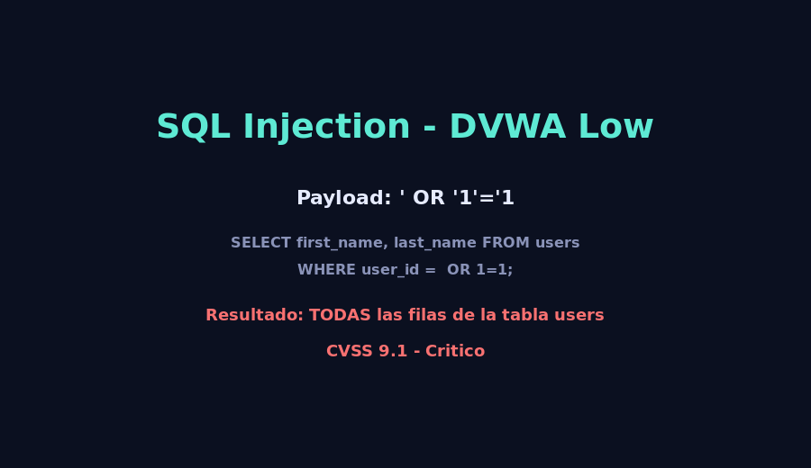

# 02 - Inyeccion SQL (SQLi)

## Descripcion tecnica

La **inyeccion SQL** es una vulnerabilidad que ocurre cuando la aplicacion concatena
entradas del usuario directamente dentro de una consulta SQL sin sanitizar ni parametrizar.
Un atacante puede alterar la logica de la consulta y ejecutar sentencias arbitrarias
contra la base de datos.

### Vector de ataque (DVWA - nivel Low)

Campo `user_id` del modulo **SQL Injection**:

```sql
SELECT first_name, last_name FROM users WHERE user_id = '$id';
```

Payload malicioso (campo de texto):

```
' OR '1'='1
```

Consulta resultante:

```sql
SELECT first_name, last_name FROM users WHERE user_id = '' OR '1'='1';
```

> La condicion `OR '1'='1'` es siempre verdadera, por lo que la consulta devuelve
> **todas las filas** de la tabla `users`, exponiendo credenciales y datos personales.

## Impacto en el negocio

| Sector          | Consecuencia directa                                                                       |
|-----------------|--------------------------------------------------------------------------------------------|
| Banco           | Extraccion de saldos, historial crediticio y datos KYC de clientes.                        |
| Clinica         | Filtracion de historias clinicas (PHI), violacion de HIPAA, demandas legales.             |
| E-commerce      | Robo de tarjetas, direcciones y credenciales; fraude y chargebacks.                        |
| Gobierno        | Exposicion de padron electoral, sanciones y danos reputacionales.                         |

## Puntuacion CVSS (estimada)

- **Vector:** `CVSS:3.1/AV:N/AC:L/PR:N/UI:N/S:U/C:H/I:H/A:N`
- **Base Score:** **9.1 (Critico)**
- **Justificacion:** explotable de forma remota sin autenticacion, baja complejidad,
  impacto alto en confidencialidad e integridad.

## Medidas

### Prevencion

1. **Prepared Statements (Parameterized Queries)** - medida principal.
   ```js
   // Node + mysql2
   const [rows] = await pool.execute(
     'SELECT first_name, last_name FROM users WHERE user_id = ?',
     [userId]
   );
   ```
2. **ORM con binding seguro** (Sequelize, Prisma, TypeORM).
3. **Validacion de entrada** (whitelist, tipo de dato).
4. **Principio de minimo privilegio** en la cuenta de BD.
5. **WAF** (Cloudflare, ModSecurity) como capa adicional.

### Mitigacion

- WAF con reglas OWASP CRS.
- Monitoreo de queries anomalas (slow query log, IDS).
- Rotacion inmediata de credenciales si hubo exposicion.
- Auditorias periodicas con `sqlmap` y revision de codigo.

## Evidencia

