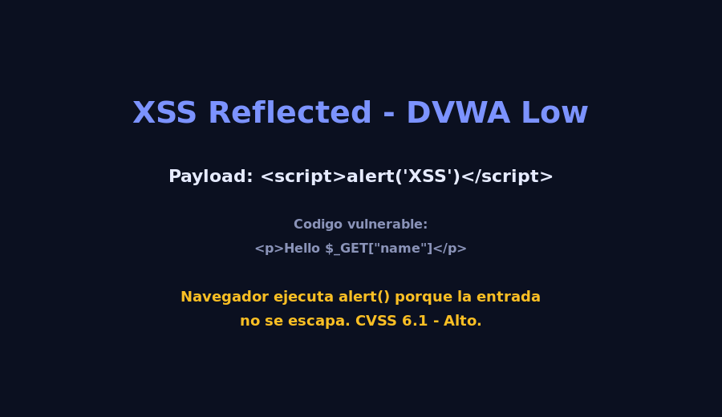

# 03 - Cross-Site Scripting (XSS)

## Descripcion tecnica

XSS permite **inyectar codigo JavaScript malicioso** en paginas vistas por otros usuarios.
Existen tres variantes:

- **Reflected XSS** - el payload viaja en la peticion (DVWA - Reflected).
- **Stored XSS** - el payload persiste en la BD.
- **DOM-based XSS** - el payload se ejecuta en el cliente sin tocar el servidor.

### Vector de ataque (DVWA - nivel Low)

Campo `name` del modulo **XSS (Reflected)**:

```html
<p>Hello <pre>$_GET['name']</pre></p>
```

Payload:

```html
<script>alert('XSS')</script>
```

Resultado en el navegador:

```html
<p>Hello <pre><script>alert('XSS')</script></pre></p>
```

> El navegador ejecuta el `<script>` porque la entrada no fue escapada.

## Impacto en el negocio

| Escenario        | Impacto                                                                    |
|------------------|----------------------------------------------------------------------------|
| Banca online     | Robo de cookies de sesion, transferencia no autorizada.                    |
| Redes sociales   | Defacement, robo de seguidores, propagacion de malware.                    |
| Correo web       | Lectura de correos ajenos al inyectarse en el iframe del cliente.          |
| Tiendas          | Skimming de tarjetas inyectando un script en la pagina de checkout.        |

## Puntuacion CVSS (estimada)

- **Vector:** `CVSS:3.1/AV:N/AC:L/PR:N/UI:R/S:C/C:L/I:L/A:N`
- **Base Score:** **6.1 (Medio)**
- **Justificacion:** requiere interaccion de la victima, pero el alcance cambia
  (`Scope Changed`) porque el script puede afectar al usuario legitimo.

## Medidas

### Prevencion

1. **Escapar toda salida** en HTML, atributos, JS, URL y CSS.
   - React ya escapa por defecto en JSX (`{variable}`).
   - Nunca usar `dangerouslySetInnerHTML` sin sanitizar.
2. **Politica CSP estricta:**
   ```html
   <meta http-equiv="Content-Security-Policy"
         content="default-src 'self'; script-src 'self'; object-src 'none'">
   ```
3. **Cookies `HttpOnly` + `Secure` + `SameSite=Strict`.**
4. **Sanitizadores** como DOMPurify para contenido enriquecido.

### Mitigacion

- WAF con reglas anti-XSS.
- Doble verificacion en frontend y backend.
- Rotacion de tokens CSRF/sesion tras un incidente.
- Monitoreo de DOM conMutationObserver.

## Evidencia

