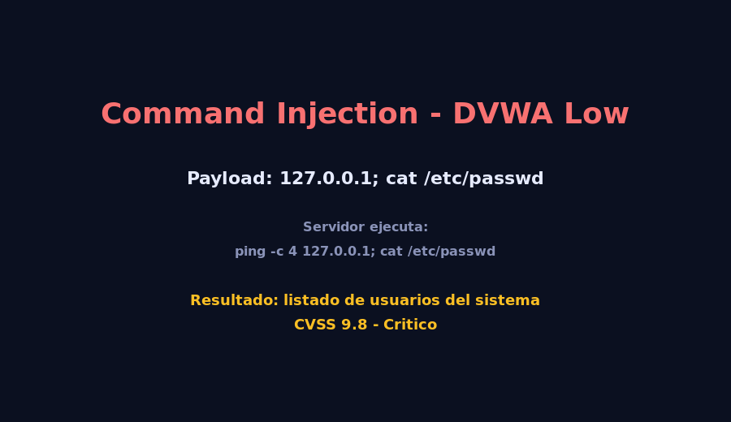

# 04 - Inyeccion de Comandos (OS Command Injection)

## Descripcion tecnica

Ocurre cuando la aplicacion pasa datos del usuario **directamente a una shell**
(`system()`, `exec()`, `popen()`, `bash -c`, etc.) sin validacion.
Un atacante puede encadenar comandos adicionales usando `;`, `&&`, `||` o `|`.

### Vector de ataque (DVWA - nivel Low)

Campo `ip` del modulo **Command Injection** ejecuta:

```php
$target = $_REQUEST['ip'];
$cmd = shell_exec('ping -c 4 ' . $target);
```

Payload:

```
127.0.0.1; cat /etc/passwd
```

Comando ejecutado en el servidor:

```bash
ping -c 4 127.0.0.1; cat /etc/passwd
```

> El servidor primero hace ping y luego **vuelca el archivo de usuarios del sistema**,
> exponiendo hashes y nombres de cuentas internas.

## Impacto en el negocio

| Vector                | Consecuencia directa                                                 |
|-----------------------|----------------------------------------------------------------------|
| Servidor Linux        | Listado de usuarios, lectura de `/etc/shadow` con privilegios.       |
| Contenedor Docker     | Escape a host si se monta el socket de Docker.                       |
| Cloud (AWS/Azure/GCP) | Robo de metadata en `169.254.169.254`, persistencia, ransomware.     |
| Base de datos         | Acceso a archivos planos de SQLite/MySQL sin pasar por la app.        |

## Puntuacion CVSS (estimada)

- **Vector:** `CVSS:3.1/AV:N/AC:L/PR:N/UI:N/S:U/C:H/I:H/A:H`
- **Base Score:** **9.8 (Critico)**
- **Justificacion:** explotable de forma remota sin autenticacion y puede
  comprometer totalmente el host (CIA = High).

## Medidas

### Prevencion

1. **Evitar `exec()`/`system()`** siempre que sea posible. Usar APIs nativas:
   ```js
   import { ping } from 'ping';   // libreria JS, no llama a la shell
   ```
2. **Validacion estricta con whitelist** (IPv4, IPv6, hostname regex).
   ```js
   const ipv4 = /^((25[0-5]|2[0-4]\d|[01]?\d?\d)\.){3}$/;
   if (!ipv4.test(ip)) throw new Error('IP invalida');
   ```
3. **Parametrizar argumentos** si se debe llamar al sistema (e.g. `spawn(['ping', '-c', '4', ip])`).
4. **Ejecutar el proceso como usuario no-root** (`nobody`, `www-data` sin sudo).
5. **Contenedores efimeros** con `read-only rootfs` y `cap_drop: ALL`.

### Mitigacion

- AppArmor / SELinux en modo enforcing.
- Limitar comandos permitidos via `seccomp` profile.
- WAF con lista negra de metacaracteres (`;`, `|`, `&`, backticks).
- Alertas en SIEM por `child_process.exec` o `system()` con input externo.

## Evidencia

